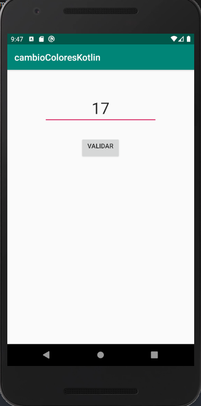
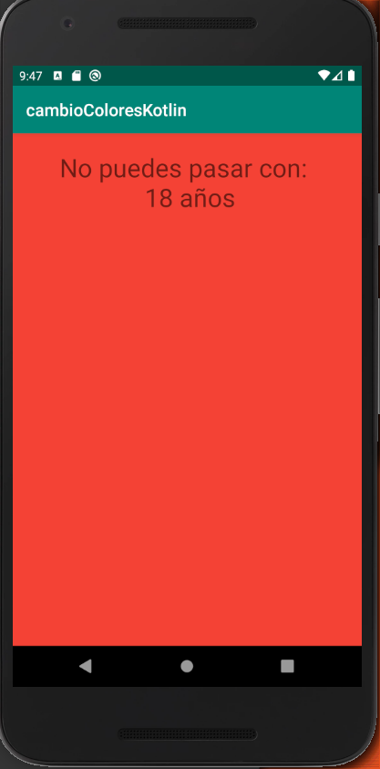
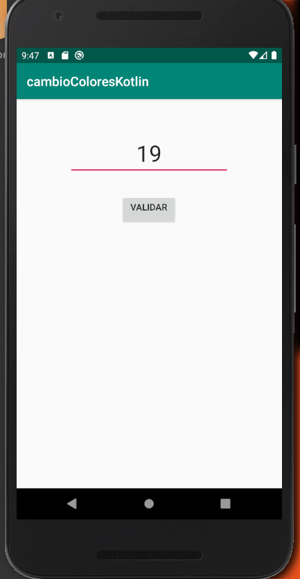
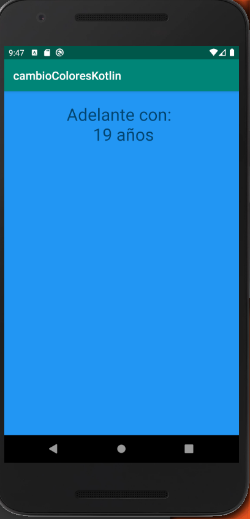
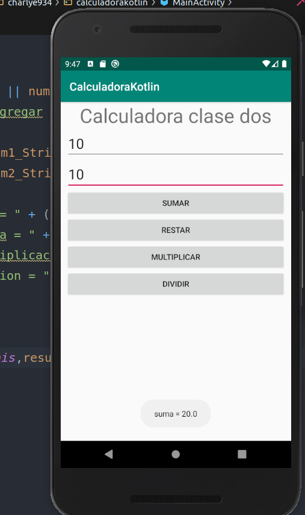

# Uso de Intent y Toast

### Ejemplo de envio de informacion e inicio de otra actividad con Intent

```kotlin
//Enviar datos e iniciar otra actividad
val intent = Intent(this, MayorEdad::class.java).apply {
    putExtra("edad",edad)
}
startActivity(intent)
```

```kotlin
//Recuperar datos enviados en Activity2
var edad = intent.getStringExtra("edad")
txtEdadMayor.setText("Adelante con: \n $edad años")
startActivity(intent)
```
### Mostrar mensajes con Toast
```kotlin
Toast.makeText(this,result,Toast.LENGTH_SHORT).show()
Toast.makeText(this,result,Toast.LENGTH_LONG).show()
```

### Asignar texto, recuperar datos y tag 
```kotlin
var tag = view.tag
var etNum1_String = txtNum1.text.toString()
var txtNum2.text = "Mostrar este texto"
```

## Imagenes del proyecto IntercambioColores





## Imagenes del proyecto calculadora


## Ligas importantes para mas informacion

### Intents y filtros de intents

https://developer.android.com/guide/components/intents-filters?hl=es

### Intents comunes
https://developer.android.com/guide/components/intents-common?hl=es

### Toast
https://developer.android.com/reference/android/widget/Toast


