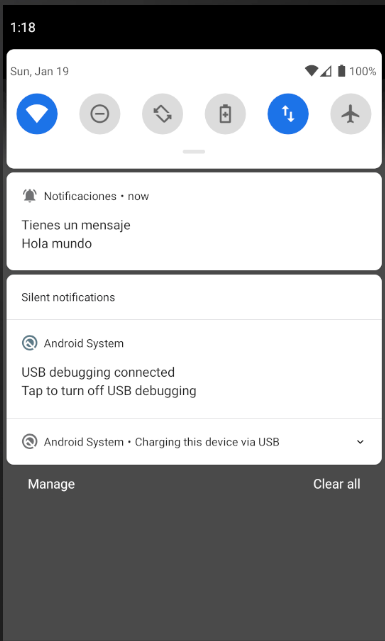
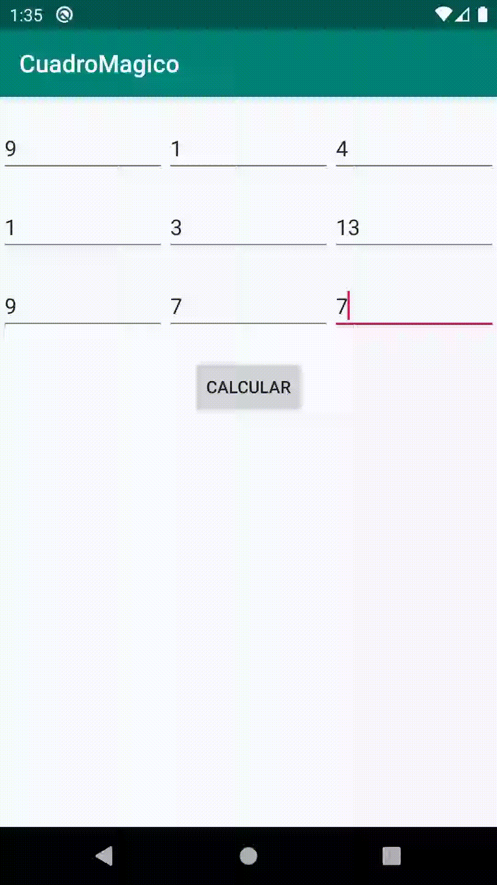

# Uso de notificaciones y ejercicio de cuadro magico

### Ejemplo del uso de Notificaciones

```kotlin
//Funcion para crear la notificacion
private fun createNotificationChannel() {
        // Create the NotificationChannel, but only on API 26+ because the NotificationChannel class is new and not in the support library
        if (Build.VERSION.SDK_INT >= Build.VERSION_CODES.O) {
            val name = getString(R.string.channel_name)
            val descriptionText = getString(R.string.channel_description)
            val importance = NotificationManager.IMPORTANCE_DEFAULT
            val channel = NotificationChannel(name, name, importance).apply {
                description = descriptionText
            }
            // Register the channel with the system
            val notificationManager: NotificationManager =
                getSystemService(Context.NOTIFICATION_SERVICE) as NotificationManager
            notificationManager.createNotificationChannel(channel)
        }
    }
```

```kotlin
//funcion para mostrar la notificacion
fun mostrarNotificacion(view: View) {
        val intent = Intent(this, AlertDetails::class.java).apply {
            flags = Intent.FLAG_ACTIVITY_NEW_TASK or Intent.FLAG_ACTIVITY_CLEAR_TASK
        }
        val pendingIntent: PendingIntent = PendingIntent.getActivity(this, 0, intent, 0)

        var sonido = RingtoneManager.getDefaultUri(RingtoneManager.TYPE_NOTIFICATION)
        var builder = NotificationCompat.Builder(this, getString(R.string.channel_name))
            .setSmallIcon(R.drawable.notificacion)
            .setContentTitle("Tienes un mensaje")
            .setContentText("Hola mundo")
            .setSound(sonido)
            .setContentIntent(pendingIntent)
            .setStyle(NotificationCompat.BigTextStyle())
            .setPriority(NotificationCompat.PRIORITY_DEFAULT)
            .setAutoCancel(true)

        with(NotificationManagerCompat.from(this)) {
            // notificationId is a unique int for each notification that you must define
            notify(R.string.channel_name, builder.build())
        }
    }
```




### Ejercicio cuadro magico

