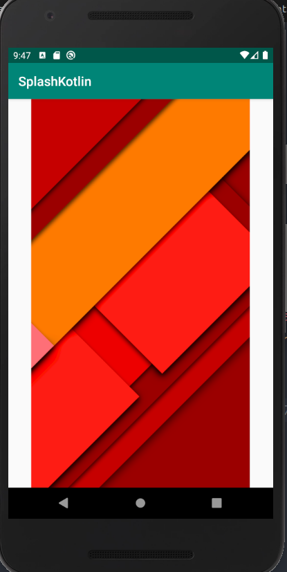
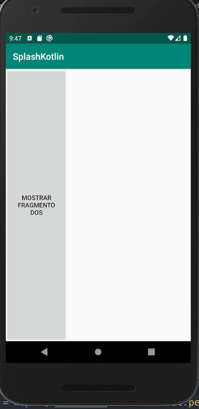
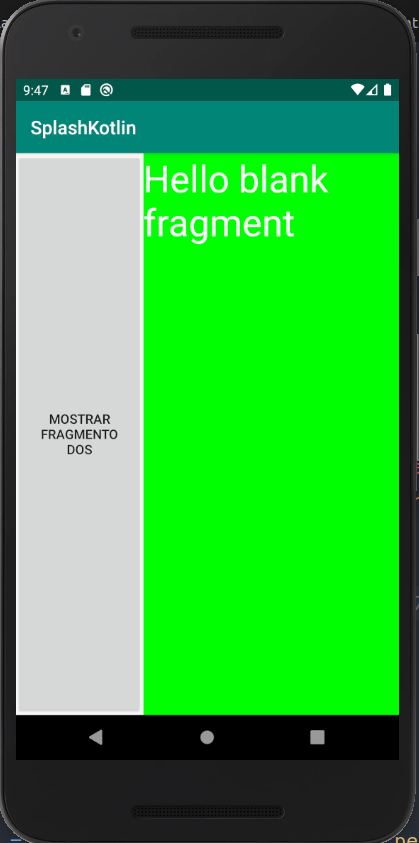
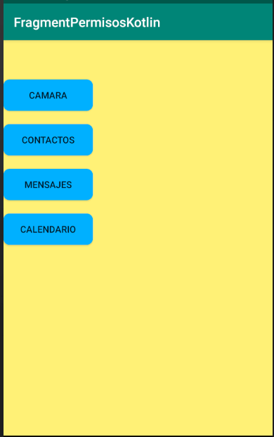
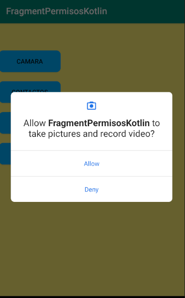
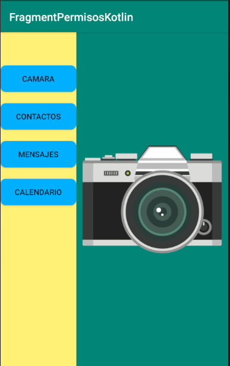
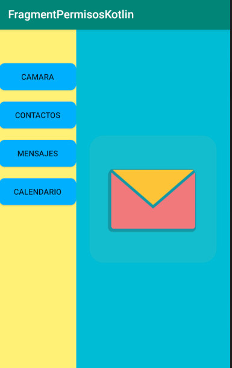

# Uso de Splash, Fragments, permisos y variables Map

### Ejemplo del uso de splash con Handler
```kotlin
var handler = Handler()
handler.postDelayed({ abrirMain() }, 3000)
```

### Ejemplo para pedir permisos 
```xml
<!--Para poder perdir permisos es necesario primero escribir los permisos
que necesitamos en el manifest-->
<uses-permission android:name="android.permission.READ_CALENDAR"/>
<uses-permission android:name="android.permission.READ_CONTACTS"/>
<uses-permission android:name="android.permission.CAMERA"/>
<uses-permission android:name="android.permission.READ_SMS"/>
```
```kotlin
//variable de tipo map para permisos
var permisos: Map<String,String>  = mapOf("camara" to  Manifest.permission.CAMERA, "mensaje" to Manifest.permission.READ_SMS, "contactos" to Manifest.permission.READ_CONTACTS, "calendario" to Manifest.permission.READ_CALENDAR)
```
```kotlin
fun permisos(tag:String):Boolean{
  var version = Build.VERSION.SDK_INT

  if(version>=Build.VERSION_CODES.M){
      if(ContextCompat.checkSelfPermission(applicationContext, permisos.get(tag).toString()) != PackageManager.PERMISSION_GRANTED){
          ActivityCompat.requestPermissions(this@MainActivity, arrayOf(permisos[tag]), 1000)
          return false
      }else{ return true }
  } else {
      Toast.makeText(applicationContext, "No es necesario pedir permisos", Toast.LENGTH_SHORT).show()
      return true
  }
}
```

### Ejemplo del uso de Fragments
```xml
<!--Integracion de fragment en un activity (puede ser con fragment o mediante framelayout u otro componente)-->
<?xml version="1.0" encoding="utf-8"?>
<LinearLayout xmlns:android="http://schemas.android.com/apk/res/android"
  xmlns:app="http://schemas.android.com/apk/res-auto"
  xmlns:tools="http://schemas.android.com/tools"
  android:layout_width="match_parent"
  android:layout_height="match_parent"
  android:background="#FFF176"
  tools:context=".MainActivity">

  <FrameLayout
      android:id="@+id/contenedor"
      android:layout_width="0dp"
      android:layout_height="match_parent"
      android:layout_weight="2" />
</LinearLayout>
```
```kotlin
//Variables de tipo Map
var fragment: Map<String,Fragment> = mapOf("camara" to CamaraFragment(), "mensaje" to MensajesFragment(), "contactos" to ContactosFragment(), "calendario" to CalendarioFragment())
```
```kotlin
val fragmentManager = supportFragmentManager
var fragmentTransaction = fragmentManager.beginTransaction()
var tag = view.getTag().toString()
if(permisos(tag)){
    //fragmentTransaction.remove(fragment[tag]!!)
    //fragmentTransaction.add(R.id.contenedor, fragment[tag]!!,"f1")
    fragmentTransaction.replace(R.id.contenedor, fragment[tag]!!,"f1")
    fragmentTransaction.addToBackStack("f1")
    fragmentTransaction.commit()
}
```
## Imagenes del proyecto Splash





## Imagenes del proyecto FragmentPermisos





## Ciclo de vida de un activity

Siguiendo el diagrama anterior, se puede visualizar el ciclo de vida en acción a medida que avanza el código. A continuación describiremos cada una de las devoluciones que se le realiza a una llamada:

onCreate () : Llamado por el sistema operativo cuando se crea la actividad por primera vez. Aquí es donde se inicializan los elementos de la interfaz de usuario u objetos de datos. También tiene el estado savedInstanceState de la actividad que contiene su estado guardado anteriormente y puede usarlo para recrear ese estado.

onStart () : Antes de presentar al usuario una actividad, se llama a este método. Siempre es seguido por onResume() . Aquí, por lo general, debe iniciar animaciones de IU, contenido basado en audio o cualquier otra cosa que requiera el contenido de la actividad esté en la pantalla.

onResume () : Cuando una actividad entra en primer plano, se llama a este método. Aquí tiene un buen lugar para reiniciar las animaciones, actualizar los elementos de la interfaz de usuario, reiniciar las vistas previas de la cámara, reanudar la reproducción de audio / video o inicializar cualquier componente que libere durante onPause() .

onPause () : Se llama a este método antes de pasar al fondo. Aquí debe detener cualquier imagen o audio asociado con la actividad, como las animaciones de la interfaz de usuario, la reproducción de música o la cámara. A este método le sigue onResume() si la actividad vuelve al primer plano o onStop() si se oculta.

onStop () : Este método se llama justo después de onPause() , cuando la actividad ya no es visible para el usuario, y es un buen lugar para guardar los datos que desea enviar al disco. Le sigue onRestart() , si esta actividad vuelve a primer plano, o onDestroy() si se libera de la memoria.

*onRestart () *: Se llama después de detener una actividad, pero justo antes de comenzar de nuevo. Siempre es seguido por onStart() .

*onDestroy () *: Esta es la devolución de llamada final que recibirá del sistema operativo antes de que se destruya la actividad. Puede desencadenar la destrucción de una actividad llamando a finish() , o puede ser activada por el sistema cuando se necesita recuperar la memoria. Si su actividad incluye subprocesos en segundo plano u otros recursos de larga duración, la destrucción podría provocar una pérdida de memoria si no se liberan, por lo que también debe recordar detener estos procesos aquí.

## Ciclo de vida de un Fragment

Un fragment( fragmento ) es un componente de Android que contiene parte del comportamiento y / o IU de una activity( actividad ). Como su nombre indica, los fragmentos no son entidades independientes, sino que están vinculados a una sola actividad. En muchos sentidos, tienen una funcionalidad similar a las actividades.

Los siguientes eventos del ciclo de vida intervienen cuando se agrega un fragmento:

onAttach: El fragmento se adjunta a su actividad de host.

onCreate: Create una nueva instancia de fragmento, que siempre ocurre después de que se conecta al host.

onCreateView: Un fragmento crea su parte de la jerarquía de vistas, que se agrega a la jerarquía de vistas de su actividad.

onActivityCreated: La actividad del fragmento ha terminado su propio evento onCreate.

onStart: El fragmento es visible. Un fragmento comienza sólo después de que comienza su actividad y a menudo comienza inmediatamente después de que su actividad lo haga.

onResume: El fragmento es visible e interactivo. Un fragmento se reanuda solo después de que se reanuda su actividad y a menudo se reanuda inmediatamente después de que la actividad lo haga.

Por ultimo, estos eventos del ciclo de vida suceden cuando se elimina un fragmento:

onPause: El fragmento ya no puede interactuar. Esto ocurre cuando el fragmento está a punto de ser eliminado o reemplazado o cuando la actividad del fragmento se detiene.

onStop: El fragmento ya no es visible. Esto ocurre después de que el fragmento está a punto de ser removido o reemplazado o cuando la actividad del fragmento se detiene.

onDestroyView: La vista y los recursos relacionados creados en onCreateView se eliminan de la jerarquía de vistas de la actividad y se destruyen.

onDestroy: El fragmento realiza su limpieza final.

onDetach: El fragmento se separa de su actividad.

## Ligas para mas informacion

### Handler
https://developer.android.com/reference/android/os/Handler

## Fragments
https://developer.android.com/guide/components/fragments
https://developer.android.com/training/basics/fragments/creating
https://developer.android.com/training/basics/fragments/testing
https://developer.android.com/training/basics/fragments/fragment-ui
https://developer.android.com/training/basics/fragments/communicating

## Permisos
https://developer.android.com/guide/topics/permissions/overview?hl=es-419
https://developer.android.com/training/permissions/requesting?hl=es-419
https://developer.android.com/training/permissions/usage-notes?hl=es-419
https://developer.android.com/guide/topics/permissions/default-handlers?hl=es-419

