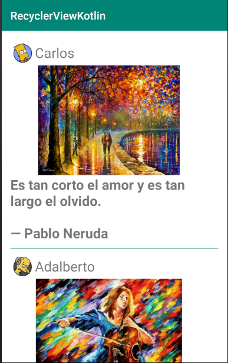
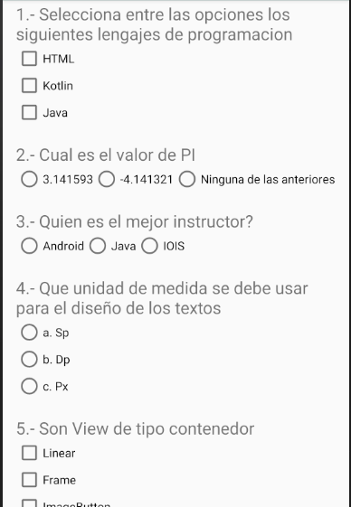
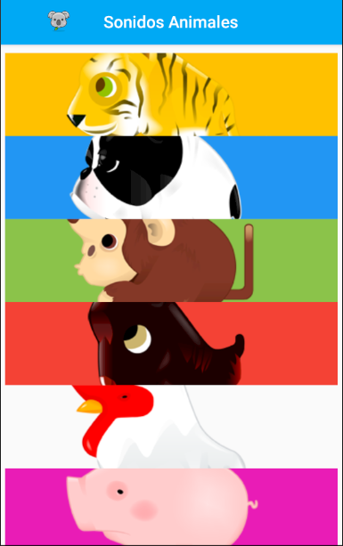

# Uso de ScrollView, ReciclyerView, Icono en action bar,MediaPlayer y creacion de un test (checkbox y radiobutton)

### Ejemplo RecyclerView

```xml
<!--Colocando recyler en activity xml-->
<?xml version="1.0" encoding="utf-8"?>
<LinearLayout xmlns:android="http://schemas.android.com/apk/res/android"
    xmlns:app="http://schemas.android.com/apk/res-auto"
    xmlns:tools="http://schemas.android.com/tools"
    android:layout_width="match_parent"
    android:layout_height="match_parent"
    android:orientation="vertical"
    android:paddingTop="16dp"
    android:paddingRight="16dp"
    android:paddingLeft="16dp"
    android:background="#FFFFFF"
    tools:context=".MainActivity">

    <androidx.recyclerview.widget.RecyclerView
        android:id="@+id/myRecycler"
        android:layout_width="match_parent"
        android:layout_height="wrap_content" />
</LinearLayout>
```

```kotlin
//Clase pojo
data class Cuadros(var imagen:Int, var foto:Int, var nombre:String, var descripcion:String)
```

```kotlin
//Creando recycler
class miAdaptador(var listaCuadros: ArrayList<Cuadros>):RecyclerView.Adapter<miAdaptador.miViewHolder>(){
    override fun onCreateViewHolder(parent: ViewGroup, viewType: Int): miViewHolder {
        var vista = LayoutInflater.from(parent.context).inflate(R.layout.item_list,parent,false)
        return miViewHolder(vista)
    }

    override fun getItemCount(): Int {
        return listaCuadros.size
    }

    override fun onBindViewHolder(holder: miViewHolder, position: Int) {
        var item = listaCuadros.get(position)
        holder.enlazar(item)
    }

    class miViewHolder(itemView: View):RecyclerView.ViewHolder(itemView) {
        fun enlazar(cuadros: Cuadros){
            itemView.idNombre.text = cuadros.nombre
            itemView.idDescripcion.text = cuadros.descripcion
            itemView.idImagen.setImageResource(cuadros.imagen)
            itemView.idFoto.setImageResource(cuadros.foto)
        }
    }
}
```

```kotlin
//ejecutando recycler
for(i in 0..nombre.size-1)
  lista.add(Cuadros(imagenes[i],fotos[i],nombre[i],frases[i]))

  var miManager = LinearLayoutManager(this)
  myRecycler.layoutManager = miManager
  myRecycler.adapter = miAdaptador(lista)
```

### Ejemplo cambio de icono en action bar
```kotlin
supportActionBar!!.setDisplayShowHomeEnabled(true)
supportActionBar!!.setIcon(R.mipmap.ic_launcher_foreground)
```

### Ejemplo sonidos con mediaplayer
```kotlin
var animaList:Map<String,Int> = mapOf("caballo" to R.raw.caballo,"cabra" to R.raw.cabra,"cerdo" to R.raw.cerdo,"gallo" to R.raw.gallo,"mono" to R.raw.mono,"perro" to R.raw.perro, "serpiente" to R.raw.serpiente,"tigre" to R.raw.tigre)
var sonidos:MediaPlayer? = null
```
```kotlin
fun ejecutaSonido(nombreAnimal:String){
    var animal = animaList.get(nombreAnimal)
    if(sonidos != null){
        sonidos!!.stop()
    }
    sonidos = MediaPlayer.create(applicationContext,animal!!)
    sonidos!!.start()
}
```

## Imagen Galeria con RecyclerView


## Imagen proyecto test


## Imagenes proyecto AnimalesSonidos

