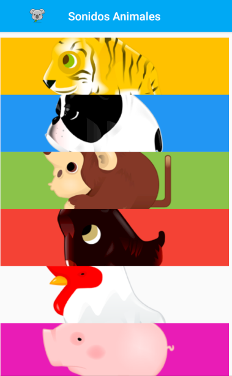
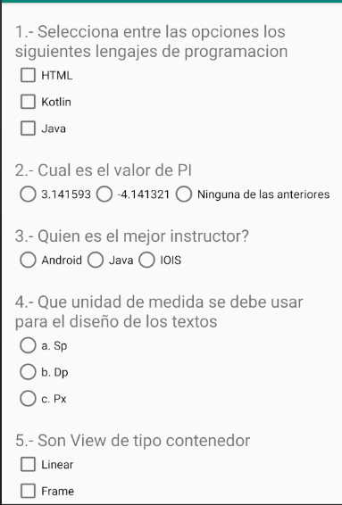

# Uso de RecyclerView, ScrollView y el uso CheckBox y RadioButtons
### Ejemplo del uso de RecyclerView

```kotlin
//ADAPTER
class miAdaptador(var listaCuadros: ArrayList<Cuadros>,val context:Context:RecyclerView.Adapter<miAdaptador.miViewHolder>(){

    override fun onCreateViewHolder(parent: ViewGroup, viewType: Int): miViewHolder {
        var vista = LayoutInflater.from(parent.context).inflate(R.layout.item_list,parent,false)
        return miViewHolder(vista)
    }

    override fun getItemCount(): Int {
        return listaCuadros.size
    }

    override fun onBindViewHolder(holder: miViewHolder, position: Int) {
        val item = listaCuadros.get(position)
        holder.pad.setOnClickListener { Toast.makeText(context,holder.pad.idDescripcion.text,Toast.LENGTH_SHORT).show() }
        holder.enlazar(item)
    }

    class miViewHolder(itemView: View):RecyclerView.ViewHolder(itemView) {
        val pad = itemView.padre

        fun enlazar(cuadros: Cuadros){
            with(itemView){
                idNombre.text = cuadros.nombre
                idDescripcion.text = cuadros.descripcion
                idImagen.setImageResource(cuadros.imagen)
                idFoto.setImageResource(cuadros.foto)
            }
        }
    }
}
```

```kotlin
//Enlazar
var miManager = LinearLayoutManager(this)
myRecycler.layoutManager = miManager
myRecycler.adapter = miAdaptador(lista,this)
```


### Ejemplo de ScrollView

```kotlin
//Poner el icono en el action bar
supportActionBar!!.setDisplayShowHomeEnabled(true)
supportActionBar!!.setIcon(R.mipmap.ic_launcher_foreground)
```


### Ejemplo de CheckBox y RadioButtons

En este proyecto se pone a prueba el uso de radiogroups, radiobutons y checkbox
