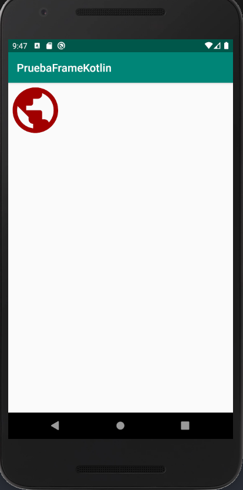
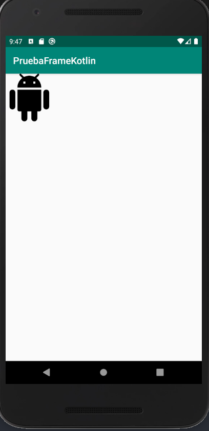
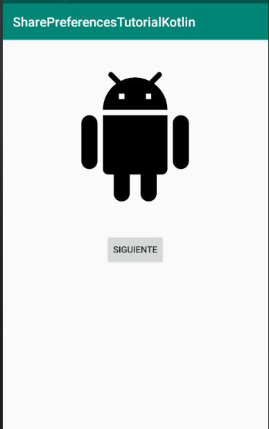
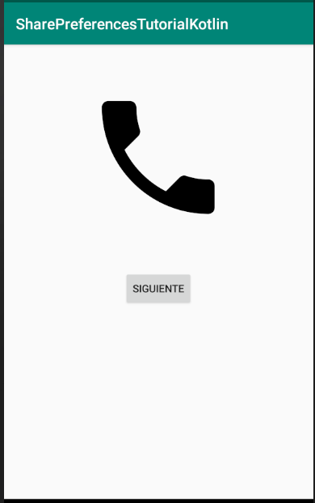
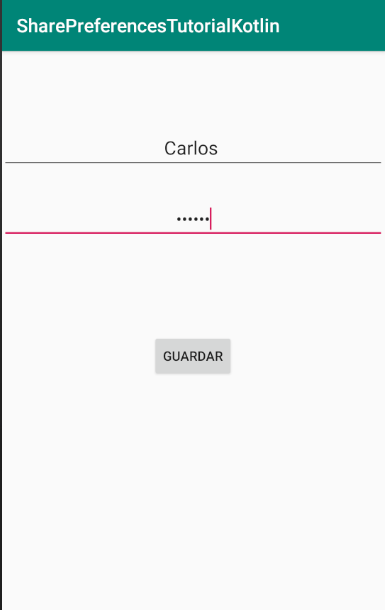
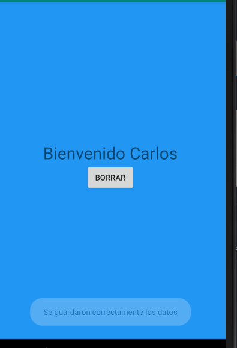

# Uso de FrameLayout y SharePreferences 

### Ejemplo del uso de visibility para cambiar imagen
```kotlin
fun cambiarImagen(view:View){
        if(img1.isVisible){
            img1.setVisibility(View.INVISIBLE)
            img2.setVisibility(View.VISIBLE)
        }else{
            img1.setVisibility(View.VISIBLE)
            img2.setVisibility(View.INVISIBLE)
        }
    }
```

### Ejemplo del uso de sharepreferences

```kotlin
val sharePreferences:SharedPreferences = applicationContext.getSharedPreferences("archivo", Context.MODE_PRIVATE)
```
```kotlin
//Verificar si ya se guardarib los datos
fun leerPreferencias(sharedPreferences: SharedPreferences ): Boolean {
    var nombres = sharedPreferences.getString("nombre", null)
    return nombres != null
}
```
```kotlin
//Funcion para guardar los datos
fun guardar(sharedPreferences: SharedPreferences){
    var nombre = txtNombre.text.toString()
    var pass = txtPass.text.toString()
    if(!nombre.isEmpty() && !pass.isEmpty()){
        var objEditor = sharedPreferences.edit()
        objEditor.putString("nombre", nombre)
        objEditor.commit()
        Toast.makeText(applicationContext, "Se guardaron correctamente los datos", Toast.LENGTH_SHORT).show()
        cambiarPagina()
    }else{
        Toast.makeText(applicationContext, "Se deben de llenar los campos", Toast.LENGTH_SHORT).show()
    }
}
```

## Imagenes del proyecto PruebaFrame



## Imagenes del proyecto SharePreferences




